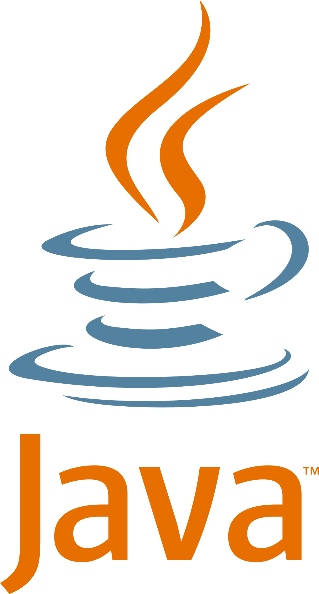
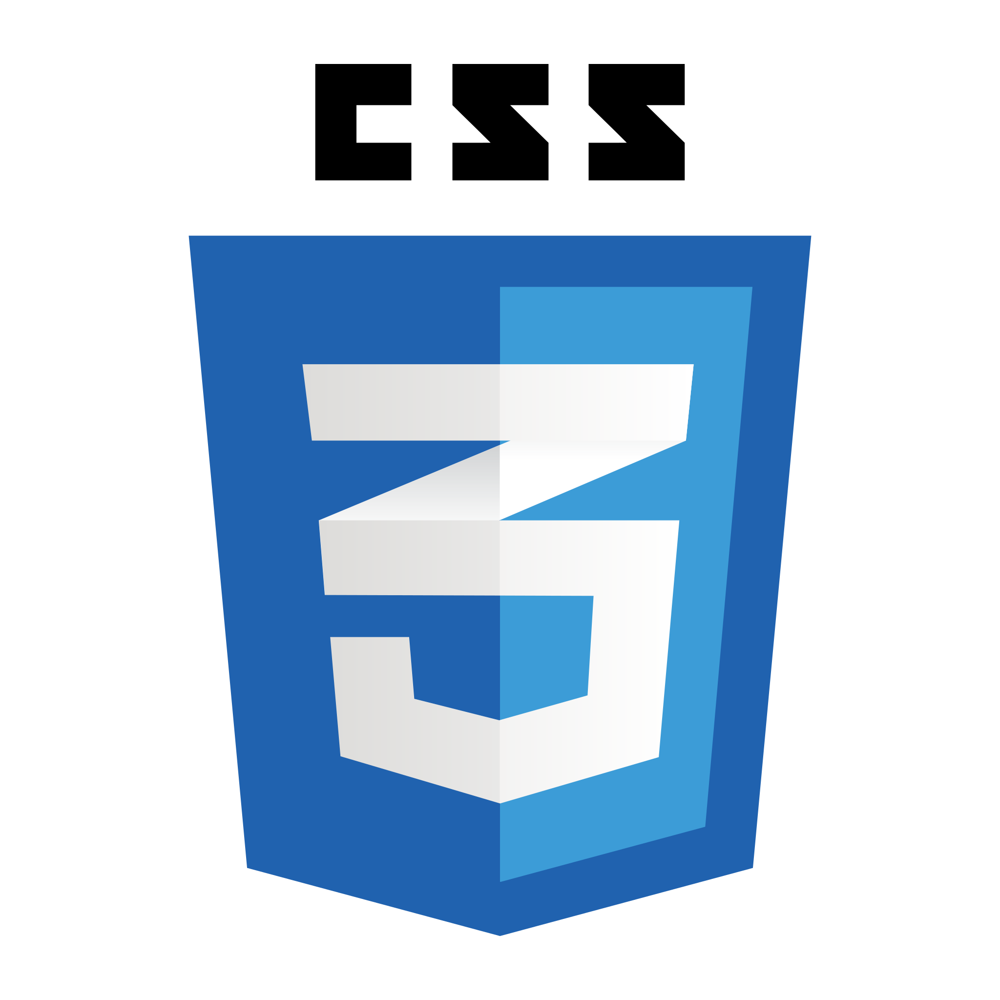

# Hello! I am Nivas

Welcome to my GitHub profile!

## About Me

I upload solutions to real-world application problems and contribute to open-source projects with clean, well-documented code.

## Tech Stack

   
  

 

                                                              
  

   
  

## Contact

- **LinkedIn**: [Nivash S](https://www.linkedin.com/in/nivas-subramani-65b470254)
- **Email**: nivasakki222@gmail.com

Thank you for visiting my profile! Feel free to reach out or contribute to any of my projects.
